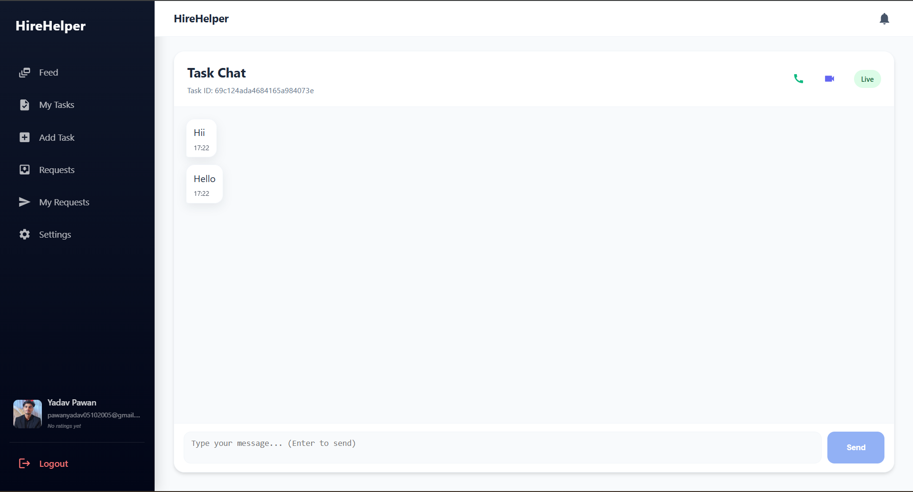
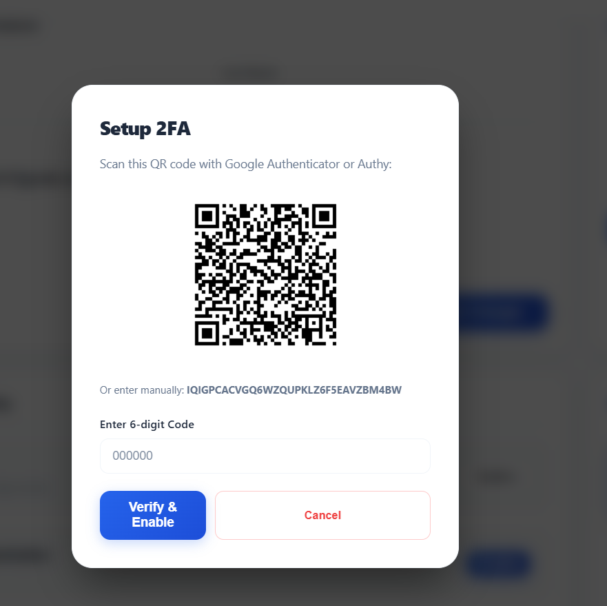

# 🚀 HireHelper-Batch1  

HireHelper ek modern full-stack web application hai jaha users tasks post kar sakte hain, help request bhej sakte hain, real-time chat kar sakte hain aur apna workflow efficiently manage kar sakte hain.  

> 💡 A smart task marketplace with real-time chat, notifications, and secure workflow system.

---

## 🆕 Version 2.0 Updates  

- ✨ Complete UI redesign (modern, clean & responsive)  
- 🔐 Two-Factor Authentication (2FA) added  
- ⚙️ Advanced Settings features introduced  
- 💬 Improved Task Chat UI & performance  
- 🚀 Faster navigation & optimized APIs  
- 🐛 Bug fixes & overall UX improvement  

---

## 📸 Application Screenshots  

### 🏠 Home Page  
  

### 📝 Signup Page  
  

### 📧 OTP Verification  
  

### 🔐 Login Page  
  

### 📋 Feed  
  

### 📌 My Tasks  
  

### 📋 Add Tasks  
  

### 🔄 Request System  
  

### 📤 My Requests  
  

### 🔔 Notifications  
  

### 💬 Task Chat  
  

### 🔐 2FA Setup  
  

### ⚙️ Settings  
  

---

## ✨ Features  

### 🔐 Authentication & Security  
- OTP-based signup & email verification  
- JWT authentication  
- Password encryption using bcrypt  
- Forgot password & reset system  
- 🔐 2FA (Two-Factor Authentication) support  
- Protected routes  

---

### 📊 UI & Dashboard  
- Modern redesigned UI (v2.0)  
- Fully responsive design  
- Smooth navigation  
- Better user experience  

---

### 📋 Task Management  
- Create, edit, delete tasks  
- Add title, description, category & location  
- Upload task images  
- Track task status: `open`, `assigned`, `completed`  
- Manage personal tasks  

---

### 🔄 Request System  
- Send task requests  
- Accept / reject requests  
- Prevent duplicate requests  
- Track request status  

---

### 📤 My Requests  
- View all sent requests  
- Real-time status updates  
- Access task details  

---

### 🔔 Notifications  
- Real-time notifications  
- Request updates  
- Mark as read  

---

### 💬 Task Chat  
- Real-time chat using Socket.IO  
- Smooth messaging experience  
- Better coordination between users  

---

### ⚙️ Settings  
- Update profile details  
- Upload profile image  
- Manage account preferences  
- 🔐 Enable & manage 2FA  
- Secure user settings panel  

---

## 🛠️ Tech Stack  

### Frontend  
- React.js (Vite)  
- Tailwind CSS  
- Axios  
- React Router DOM  
- Socket.IO Client  

### Backend  
- Node.js  
- Express.js  
- MongoDB + Mongoose  
- JWT Authentication  
- bcrypt  
- Nodemailer  

### Tools & Services  
- Cloudinary (Image Upload)  
- Socket.IO (Realtime Chat)  

---

## 🔗 API Routes  

### 🔐 Auth  
POST   /api/auth/register  
POST   /api/auth/login  
POST   /api/auth/verify-otp  
POST   /api/auth/resend-otp  
POST   /api/auth/forgot-password  
POST   /api/auth/reset-password  

---

### 📋 Tasks  
POST   /api/tasks/create  
GET    /api/tasks/all  
GET    /api/tasks/:id  
PUT    /api/tasks/update/:id  
DELETE /api/tasks/delete/:id  
GET    /api/tasks/my  
GET    /api/tasks/assigned  

---

### 🔄 Requests  
POST   /api/requests/send  
GET    /api/requests/my  
GET    /api/requests/received  
PUT    /api/requests/accept/:id  
PUT    /api/requests/reject/:id  

---

### 🔔 Notifications  
GET    /api/notifications  
PUT    /api/notifications/read/:id  
PUT    /api/notifications/read-all  

---

### 💬 Chat  
POST   /api/chat/message  
GET    /api/chat/history  

---

### 👤 User  
GET    /api/users/profile  
PUT    /api/users/update  
POST   /api/users/upload-profile  

---

## 📁 Project Structure  

```

HireHelper-Batch1/
│
├── backend/
├── frontend/
├── screenshots/
├── .env
├── README.md

````

---

## ⚙️ Installation & Setup  

### 1. Clone Repository  
```bash
git clone <your-repo-link>
cd HireHelper-Batch1
````

### 2. Backend Setup

```bash
cd backend
npm install
npm run dev
```

### 3. Frontend Setup

```bash
cd frontend
npm install
npm run dev
```

---

## 🔐 Environment Variables

### Backend (.env)

```
PORT=3000
MONGO_URI=your_mongodb_url
JWT_SECRET=your_secret
CLOUDINARY_CLOUD_NAME=your_name
CLOUDINARY_API_KEY=your_key
CLOUDINARY_API_SECRET=your_secret
EMAIL_USER=your_email
EMAIL_PASS=your_password
```

### Frontend (.env)

```
VITE_API_BASE_URL=http://localhost:3000/api
VITE_SOCKET_URL=http://localhost:3000
```

---

## 🚧 Future Improvements

* Role-based access control
* Mobile UI optimization
* Chat enhancements
* Advanced task filters

---

## 📌 Project Status

✅ Authentication
✅ Task System
✅ Request Workflow
✅ Notifications
✅ Real-time Chat
✅ Settings + 2FA

---

## 📄 License

This project is open-source and built for learning & development purposes.

---

💡 *This project demonstrates strong full-stack development skills including authentication, real-time communication, API design, and scalable architecture.*

