# HireHelper-Batch1


HireHelper is a full-stack web application where users can post tasks, request help, chat in real-time, and manage workflows efficiently. It connects people who need help with those willing to complete tasks.  

**A full-stack task marketplace with real-time chat, notifications, and smart workflow management.**
---

## 📸 Application Screenshots  

### 🏠 Home Page  
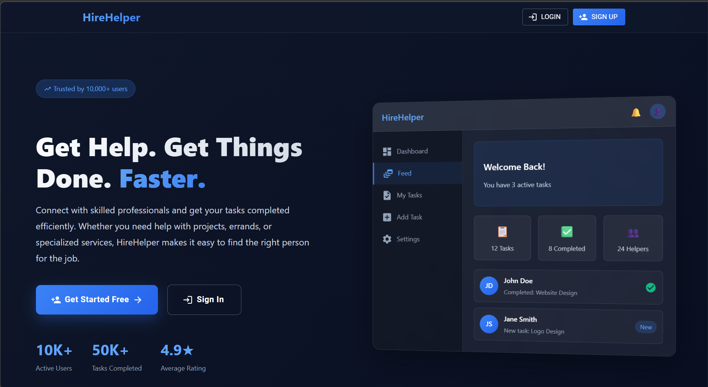 

### 📝 Signup Page  
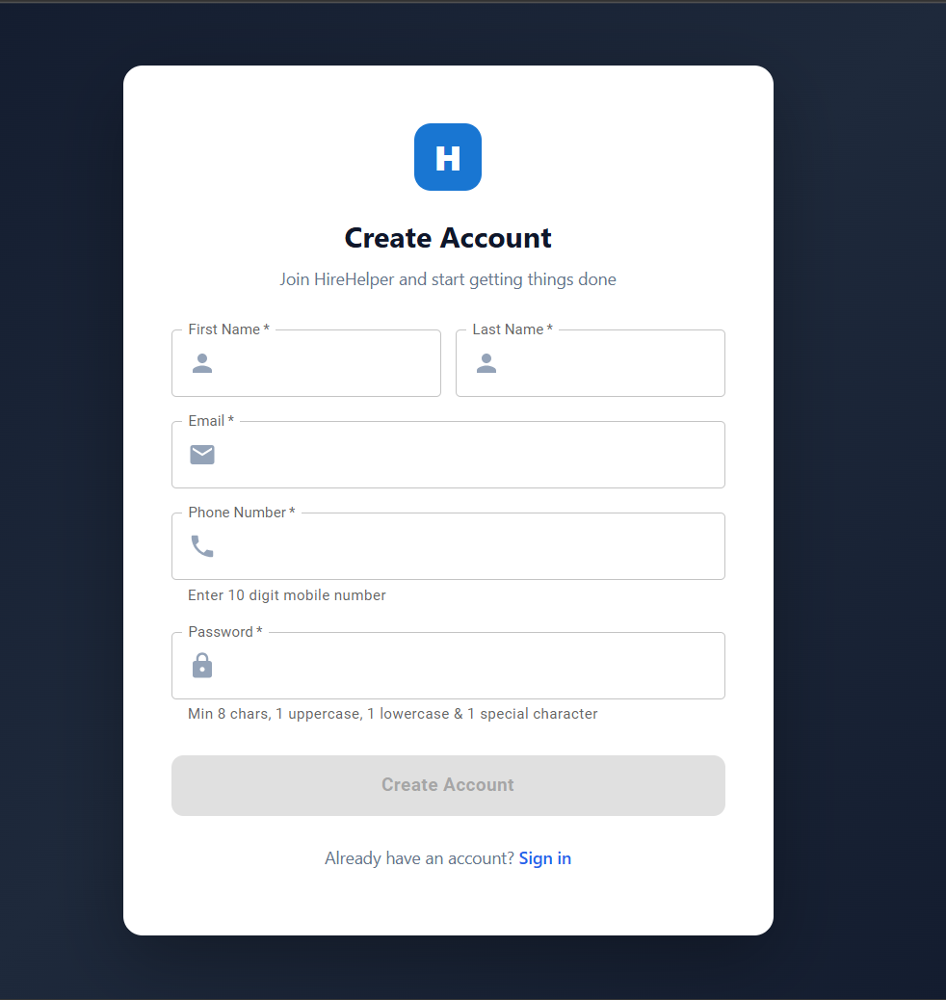  

### 📧 OTP Verification  
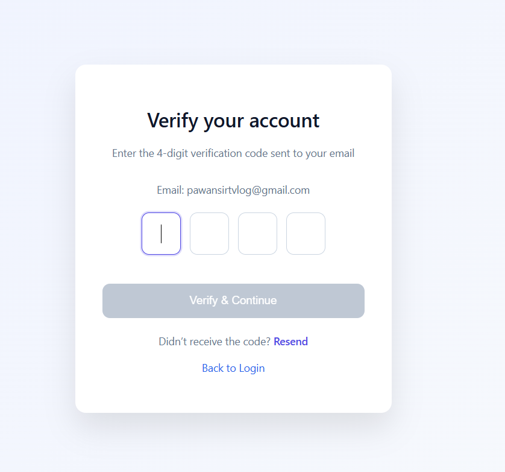 

### 🔐 Login Page  
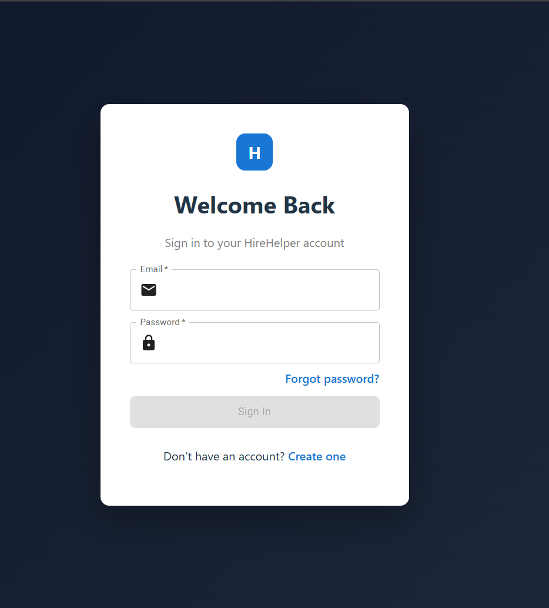  

### 📊 Dashboard  
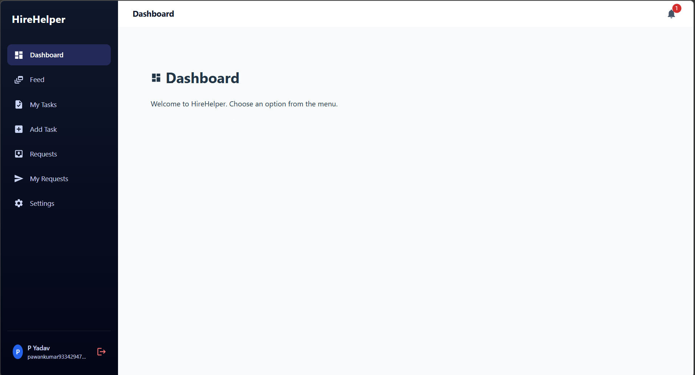 

### 📋 Feed  
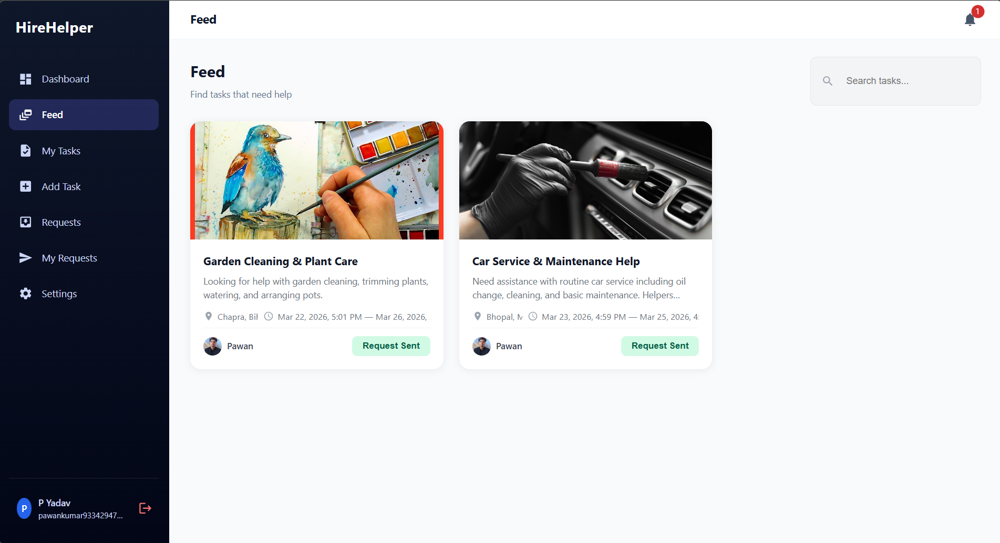  

### 📌 My Tasks  
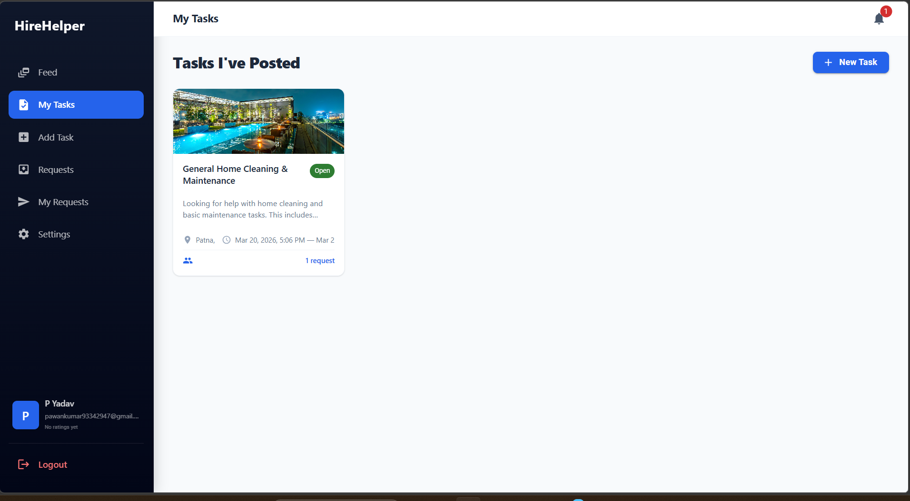  

### 📋 AddTasks Feed  
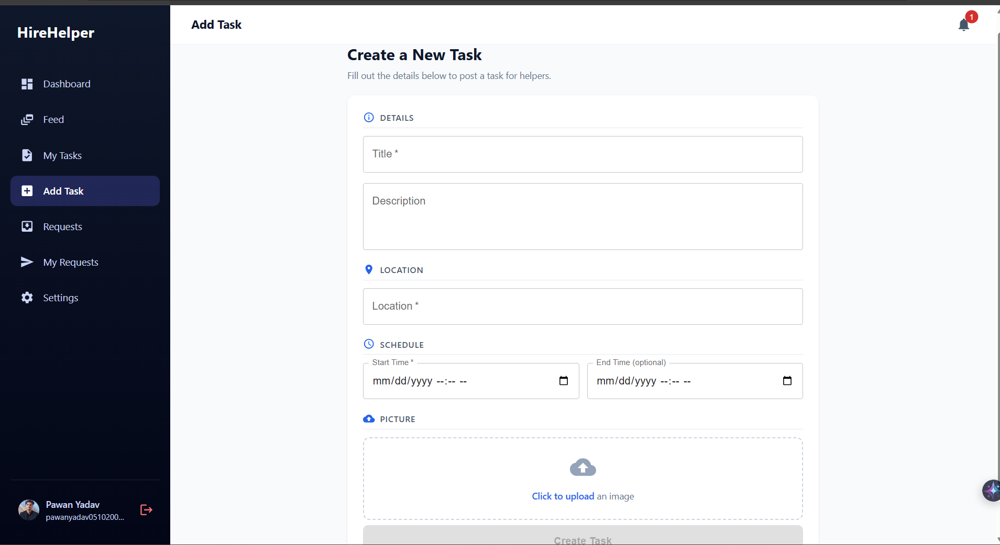  

### 🔄 Request System  
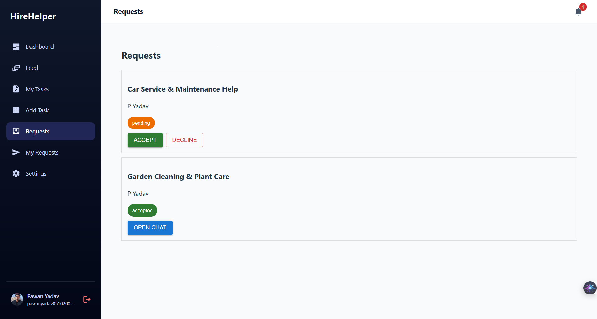  

### 📤 My Requests  
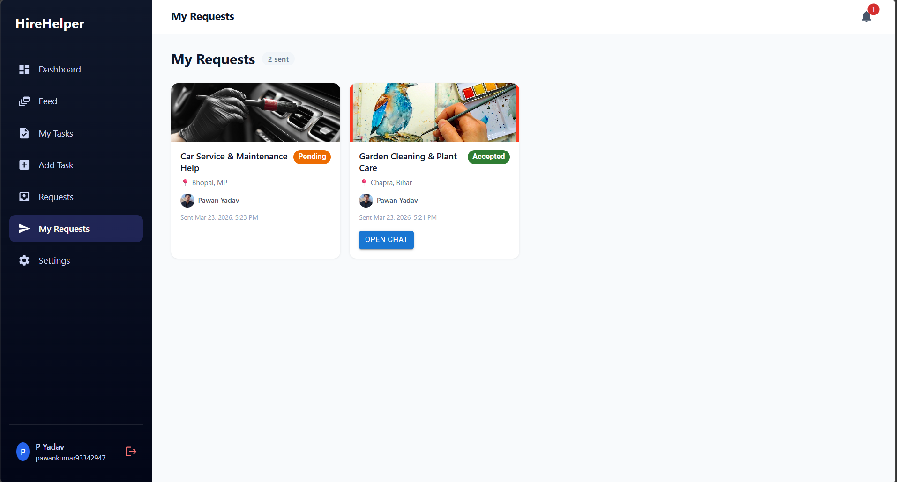  

### 🔔 Notifications  
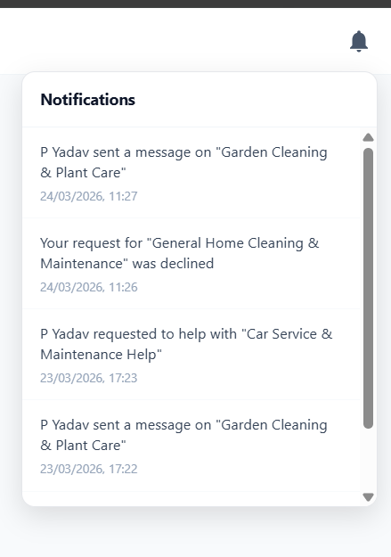  

### 🤖 Task Chat  
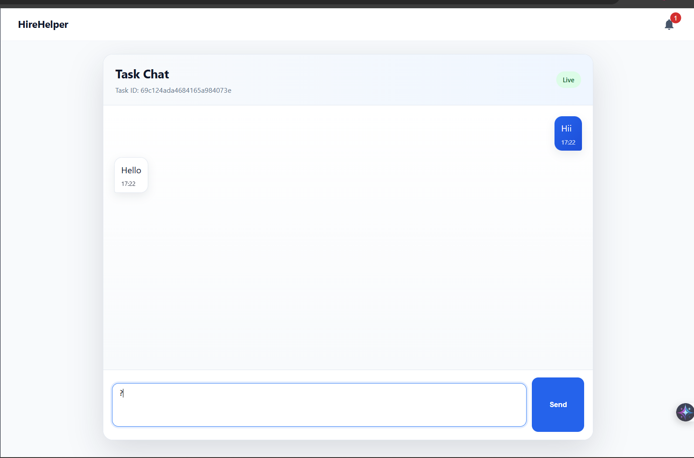  

### ⚙️ Settings Page  
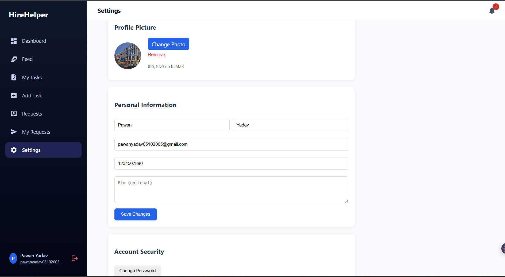  

---

## ✨ Features  

### 🔐 Authentication & Security  
- User signup with OTP email verification  
- Secure login using JWT authentication  
- Password encryption using bcrypt  
- Forgot password & OTP-based reset system  
- Protected routes for authorized access  

---

### 📊 Dashboard  
- Centralized user control panel  
- Easy navigation with sidebar  
- Quick access to all features  
- Clean and responsive UI  

---

### 📋 Task Management  
- Create new tasks with title, description, category & location  
- Add date and time for tasks  
- Upload task-related images  
- View all available tasks (Feed)  
- Manage personal tasks (My Tasks)  
- Edit and delete tasks  
- Task status tracking: `open`, `assigned`, `completed`  

---

### 🔄 Request System  
- Send request to perform tasks  
- View incoming requests  
- Accept or reject requests  
- Prevent duplicate requests  
- Track request status (pending / accepted / rejected)  

---

### 📤 My Requests  
- View all requests sent by user  
- Track status updates in real-time  
- View task details inside request  

---

### 🔔 Notifications System  
- Get notified when someone requests your task  
- Get notified when request is accepted or rejected  
- Unread notification indicator  
- Mark notifications as read  
- Real-time updates  

---

### 🤖 Task Chat (Chat System)  
- Real-time chat between users  
- Communicate after task request  
- Instant messaging experience  
- Helps in better coordination  

---

### ⚙️ Settings  
- Update profile details  
- View and update user profile  
- Upload profile image  
- Manage personal account settings   
- Manage account preferences  
- Secure user settings panel  

---

### 🎯 Additional Highlights  
- Fully responsive design  
- Clean UI using Tailwind CSS  
- Fast performance with optimized APIs  
- User-friendly interface  

---

## 🛠️ Tech Stack  

### Frontend  
- React.js / (Vite)  
- Tailwind CSS  
- Axios  
- React Router DOM  
- Socket.IO Client  

### Backend  
- Node.js  
- Express.js  
- MongoDB + Mongoose  
- JWT Authentication  
- bcrypt  
- Nodemailer  

### Cloud & Tools  
- Cloudinary (Image Upload)  
- Socket.IO (Realtime)  

---

## 🔗 API Routes  

### 🔐 Auth Routes  
POST   /api/auth/register  
POST   /api/auth/login  
POST   /api/auth/verify-otp  
POST   /api/auth/resend-otp  
POST   /api/auth/forgot-password  
POST   /api/auth/reset-password  

---

### 📋 Task Routes  
POST   /api/tasks/create  
GET    /api/tasks/all  
GET    /api/tasks/:id  
PUT    /api/tasks/update/:id  
DELETE /api/tasks/delete/:id  
GET    /api/tasks/my  
GET    /api/tasks/assigned  

---

### 🔄 Request Routes  
POST   /api/requests/send  
GET    /api/requests/my  
GET    /api/requests/received  
PUT    /api/requests/accept/:id  
PUT    /api/requests/reject/:id  

---

### 🔔 Notification Routes  
GET    /api/notifications  
PUT    /api/notifications/read/:id  
PUT    /api/notifications/read-all  

---

### 🤖 Task Chat Routes  
POST   /api/chat/message  
GET    /api/chat/history  

---

### 👤 User Routes  
GET    /api/users/profile  
PUT    /api/users/update  
POST   /api/users/upload-profile  


---

## 📁 Project Structure  

```

HireHelper-Batch1/
│
├── backend/
│ ├── controllers/ # Business logic
│ ├── models/ # Database schemas (MongoDB)
│ ├── routes/ # API route definitions
│ ├── middleware/ # Authentication & error handling
│ ├── utils/ # Helper functions (email, token, etc.)
│ ├── config/ # Database & environment config
│ └── server.js # Main backend entry point
│
├── frontend/
│ ├── src/
│ │ ├── components/ # Reusable UI components
│ │ ├── pages/ # Application pages (Login, Dashboard, etc.)
│ │ ├── context/ # Global state management
│ │ ├── services/ # API calls (Axios)
│ │ ├── hooks/ # Custom React hooks
│ │ ├── utils/ # Helper functions
│ │ └── App.jsx # Main app component
│ │
│ ├── public/ # Static assets
│ └── package.json # Frontend dependencies
│
├── screenshots/ # All README images
│ ├── banner.png
│ ├── signup.png
│ ├── otpVerify.png
│ ├── login.png
│ ├── dashboard.png
│ ├── feed.png
│ ├── myTasks.png
│ ├── addTasks.png
│ ├── requests.png
│ ├── myRequests.png
│ ├── notifications.png
│ ├── taskChat.png
│ ├── settings.png
│
├── .env # Environment variables
├── package.json # Root dependencies (if any)
├── README.md # Project documentation

````


## ⚙️ Installation & Setup  

### 1. Clone Repository  
```bash
git clone <your-repo-link>
cd HireHelper-Batch1
````

### 2. Backend Setup

```bash
cd backend
npm install
npm run dev
```

### 3. Frontend Setup

```bash
cd frontend
npm install
npm run dev
```

---

## 🔐 Environment Variables

### Backend (.env)

```
PORT=3000
MONGO_URI=your_mongodb_url
JWT_SECRET=your_secret

CLOUDINARY_CLOUD_NAME=your_name
CLOUDINARY_API_KEY=your_key
CLOUDINARY_API_SECRET=your_secret

EMAIL_USER=your_email
EMAIL_PASS=your_password
```

---

### Frontend (.env)

```
VITE_API_BASE_URL=http://localhost:3000/api
VITE_SOCKET_URL=http://localhost:3000
```

---

## 🚧 Future Improvements

* Role-based access control
* Task completion UI enhancement
* Rate limiting (OTP)
* Mobile optimization
* Task chat improvements

---

## 📌 Project Status

* Authentication Completed
* Task System Completed
* Request Workflow Completed
* Notification System Completed
* Task Chat Integration Completed
* Settings System Completed

---

## 📄 License

This project is open-source and created for learning and development purposes.

```

💡 This project demonstrates full-stack development skills including authentication, real-time communication, API design, and scalable architecture.
